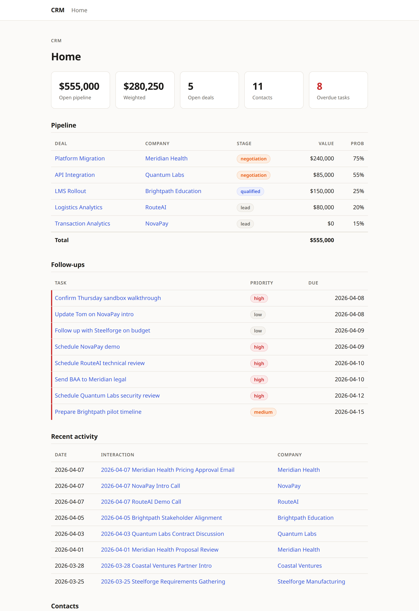

# crm-operator

**A personal CRM that lives as a folder of files, maintained for you by an AI agent.**

Drop in meeting notes, emails, or call transcripts and the agent extracts contacts,
companies, deals, interactions, and follow-up tasks — keeping everything cross-linked
and your pipeline current. You browse it as a small, self-contained website: open
`index.html` in any browser. No database, no Obsidian, no plugins. Your data is just files.



## Install

```bash
npx skills add Aakeeo/crm-operator
```

This installs the `crm-operator` skill for Claude Code, Cursor, Codex, and other
agents. Update later with `npx skills update`.

## Quick start

In your agent, just say:

> "Set up a new CRM here."

The agent scaffolds a vault (a few HTML files + a `data.js`), then you can:

- **Ingest** — "Process these meeting notes" → it files every contact/company/deal/task.
- **Query** — "What's my open pipeline?" / "What follow-ups are overdue?"
- **Update** — "Move the Northwind deal to negotiation."
- **Schedule** — "Book a demo with Dana next Tuesday" → Calendar event + Meet link.

## How it works

A CRM vault is five files plus your data:

| File | Role |
|------|------|
| `data.js` | **The database.** `window.CRM = { contacts, companies, deals, … }`. The agent only ever edits this. |
| `render.js`, `styles.css` | Shared engine — every page draws itself from `data.js`. |
| `index.html` | Home + dashboards (pipeline, follow-ups, recent activity). |
| `view.html` | Renders any single entity: `view.html?type=deal&id=…`. |

The browser renders everything locally from plain `<script src>` — no build step, no server.
Adding a contact is one edit to `data.js` and zero new files.

**Engine vs data.** The engine (`engine/`) is versioned and skill-owned; your `data.js`
and notes are yours and never overwritten. Upgrade an existing vault's engine in place with
`node scripts/update-engine.mjs <vault>` — your data is structurally untouched.

## Connectors (optional)

Connect your own accounts in Claude (`/mcp`) to light these up:

- **Gmail** — ingest threads as interactions; draft follow-ups (you send).
- **Google Calendar** — schedule meetings with attendees + Meet links.
- **Google Drive** — attach/share deal docs.

The CRM works fully with none connected. See [`skills/crm-operator/connectors.md`](skills/crm-operator/connectors.md).

## Migrating an existing markdown CRM

```bash
node skills/crm-operator/scripts/migrate.mjs <markdown-vault> <out-dir>
```

## License

MIT — see [LICENSE](LICENSE).
